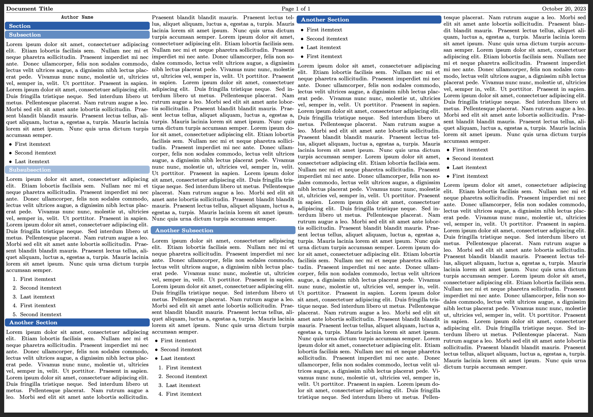

# MPS Cheatsheet

This cheatsheet is an adapted version of @marlinstrub 's [mpscheatsheet](https://github.com/marlinstrub/mpscheatsheet).

Import the class with the following statement to create space-efficient cheatsheets.

```latex
\documentclass[8pt]{mpscheatsheet}
```


